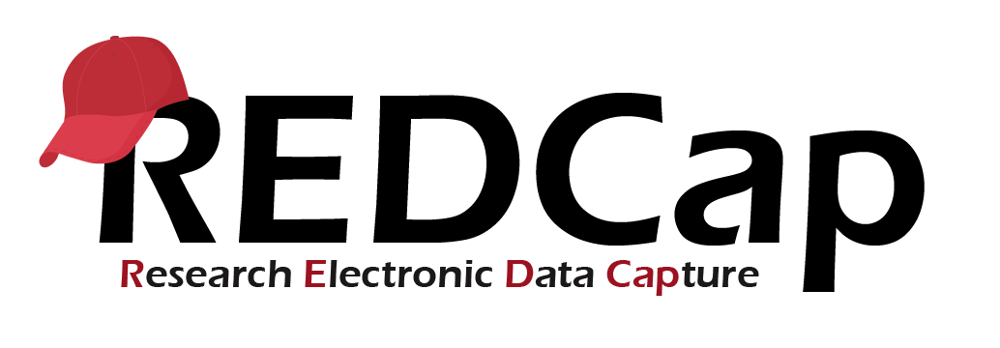

```{r libs, include=FALSE}
library(knitr)
library(tidyverse)
library(xaringan)
library(magick)
library(dbplyr)
#remotes::install_github("mitchelloharawild/icons")
library(icons)
library(xaringanExtra)
library(RSQLite)

xaringanExtra::use_share_again() # need to get the slide button on html view

opts_chunk$set(
  echo = FALSE,
  eval = FALSE,
  message = FALSE,
  warning = FALSE,
  fig.width = 7.252,
  fig.height = 4,
  dpi = 300,
  dev.args = list(type = "cairo")
)
```


class: title-slide, left, bottom

# `r rmarkdown::metadata$title`
----
## **`r rmarkdown::metadata$subtitle`**
### `r rmarkdown::metadata$author`
### `r rmarkdown::metadata$institute`


---
class: title, left

## Introduction

--

### Mode of delivery

```{r, echo=FALSE, warning=F, message=F, eval=TRUE}
library(tidyverse)
library(kableExtra)
delivery_mode <- tribble(
  ~Session, ~Topic, ~Duration,
  "Session One",      "RDBMS",      "1hr 45 mins",
  "Session Two",     "REDCap",      "1hr",
  "Session Three",     "API security",      "45 minutes"
)

delivery_mode %>% kbl() %>% 
  kable_styling()
```


<!-- - As hands-on as possible. -->

<!-- - Live coding of techniques. -->

--
.pull-left[
### Objectives/scope

- Efficiently connect R to databases.
    - RDBMS (MySQL)
    - REDCap
- Querying data stored in databases using R.
    - RDBMS (MySQL)
    - REDCap
- Managing API security.

]
--

.pull-right[
### Extras
- SQLite database.
- Automating data extraction.
]


---
class: title, center, middle

# Session One(1) -  RDBMS


```{r, echo=FALSE, warning=F, message=F, eval=TRUE}
session_one <- tribble(
  ~Session,  ~Duration, ~ Topic,
  "Slides and demo",     "xxx mins", "Connecting to a database",
  "Exercise 1",      "xx mins", " ",
  "Slides and demo",  "xxx mins", "Querying data from a database",
  "Exercise 2",  "xxx mins", " ",
  "Break",  "xxx mins", " "
)

session_one %>% kbl() %>% 
  kable_styling()
```


---
class: title, left

## Introduction to RDBMS

- Widely used to store and manage data


- Data is in tables (relations) composed of rows (tuples) and columns (variables)


- Tables/relations are inter-related using specific attributes (unique/primary keys)


- Most of the RDBMS use `SQL` to query and manage data


- Popular RDBMS include:-
    - MySQL, SQLite, PostgreSQL, Oracle, MariaDB, Ms Access etc.


---
class: title, left

## RDBMS: Creating a connection

Two ways you can connect R to a database

--

- **Use applicable odbc driver e.g. `MySQL`**

```{r, echo = T}
connection_name <- dbConnect(odbc(), #<<
                             Driver = " ",   # Specify driver name #<<
                             Server = " ",   # Server address #<<
                             Database = " ", # Database name #<<
                             Uid = " ",      # User identification #<<
                             Pwd = " " )     # User password #<<
```

--

- **DBI compliant package e.g. `RMySQL`, `RSQLite`, `ROracle` etc.**

```{r, echo = T}
connection_name <- dbConnect(MySQL(),  # DBI compliant driver #<<
                       host = " ",     # host name/server address #<<
                       dbname = " ",   # database name #<<
                       user = " ",     # user name #<<
                       password = " ") # password #<<
```


---
class: title, left

## RDBMS: Querying data

Three approaches you can query data from a database using R

--
- **Using DBI functions**

`dbSendQuery()` and `dbFetch()`

```{r, echo = T}
# Step 1
qry_results <- dbSendQuery(conn = connection_name, #<<
            statement = "SELECT * FROM ...")  #<<

# Step 2
qry_data <- dbFetch(res = qry_results) #<<
```

--

`dbGetQuery()`
  
```{r, echo = T}
qry_data <- dbGetQuery(conn = connection_name, #<<
                    statement = "SELECT * FROM ...") #<<
```
 

---
class: title, left

## RDBMS: Querying data

- **Using `dplyr` syntax**

`tbl()`, `show_query()` and `collect()`

```{r, echo = T}
qry_data <- tbl(connection_name, "table_name") %>%  #<<
  filter(sex == 1) %>%  #<<                            
  select(subjid, dob, site) %>%  #<<
  arrange(subjid, dob) #<<
```
 
--

- Advantages of `dplyr` syntax
     - Efficiency (computation is pushed to the database)
     - Memory efficient: `collect` into R only required dataset
     - All your code is in R language, SQL not necessarily needed

--

- **Using SQL code chunk in rmarkdown **
````markdown
`r ''````{sql, connection = "connection_name", output.var = "qry_data"}
SELECT * FROM tbl_lab
WHERE hb <= 18 AND sex = 1
```
````


---
class: title, center, middle

# Session Two(2) -  REDCap

```{r, echo=FALSE, warning=F, message=F, eval=TRUE}
session_two <- tribble(
  ~Session,  ~Duration, ~ Topic,
  "Slides and demo",     "xxx mins", "Connecting & querying a database",
  "Exercise 3",      "xx mins", " "
)

session_two %>% kbl() %>% 
  kable_styling()
```


---
class: title, left

##  Introduction to REDCap

.left-column[
```{r, out.width ="100%",fig.align ='left', out.height = "20%", echo = F, eval=TRUE}

```

]

.right-column[
- Secure web application for building and managing online 
surveys and databases

- Created at Vanderbilt University and can be used to collect virtually
any kind of data:-
   - Supports offline data collection (REDCap mobile app)
   - Online surveys
   
- Used by over 6219 institutions, visit [this website](https://www.project-redcap.org/) for more information.
]


---
class: title, left

## REDCap: Connecting and Querying data

There are at least 3 packages I am aware of (`redcapAPI`, `RedcapData` and `REDCapR`).
We will focus on the firts one (`redcapAPI`)

- **Creating a connection**

```{r, echo = T}
connection_name <- redcapConnection(url = "https://uat.chainnetwork.org/redcap/api/",
                               token = "125AAA97191E444C80E5A796C40F1E52")          # Establish connection with REDCap
```

--

- **Export data by event**
```{r, echo = T}
baseline <- exportRecords(rcon = connection_name, factors = TRUE, fields = NULL,  forms = NULL, records = NULL, events = "event_name",
                          labels = TRUE, dates = TRUE, survey = TRUE, dag = TRUE,  checkboxLabels = FALSE)
```

--

- **Export data by instrument**
```{r, echo = T}
baseline <- exportRecords(rcon = connection_name, factors = TRUE, fields = NULL,  forms = "instrument_name", records = NULL, events = NULL,
                          labels = TRUE, dates = TRUE, survey = TRUE, dag = TRUE,  checkboxLabels = FALSE)
```


---
class: title, center, middle

# Session Three(3) -  API security


---
class: title, left

## Managing API security

- This concerns protecting the integrity of the API code


- API credentials in the wrong hands is a data breach and can cost your
organization a fortune.


- Care should be taken to manage and secure API tokens and should not
be put directly in your code


- In R, one such way is to keep API keys a secret is via `.Renviron`
start-up file


- **Warning:** Do NOT share codes containing API keys. For GitHub collaborations, be
sure to include `.Renviron` in `.gitignore` file.


---
## Extras

### SQLite databases

- Light, serverless and portable RDBMS
- Can be used with RShiny and other data products

### Automating data extraction & processing

- It's possible to automate data extraction workflow

- CRON jobs (ONLY works in linux system), rstudio cloud or server.


